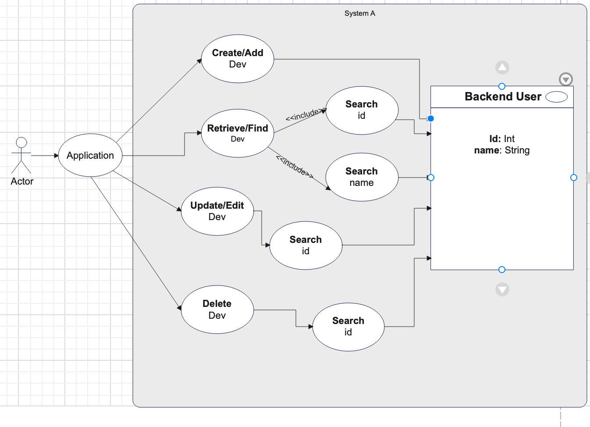

## Setup and Deployment
To set up and deploy this API locally or on a server, follow these steps:

Clone the repository from GitHub.

Install Node.js and npm if not already installed.

Navigate to the project directory and run the following command to install dependencies:

`npm install`

Set up a database connection in the knex-db/knex.js file.
Run the following command to migrate the database:

`npm run knex migrate:latest`

Start the API server with the following command:
npm start

The API will be accessible at http://localhost:3000 by default.

This documentation outlines the usage, endpoints, and setup instructions for the My Developer API. If you have any questions or need further assistance, please contact our support team at fredrickraymnd2004@gmail.com.

## UML DIAGRAM

